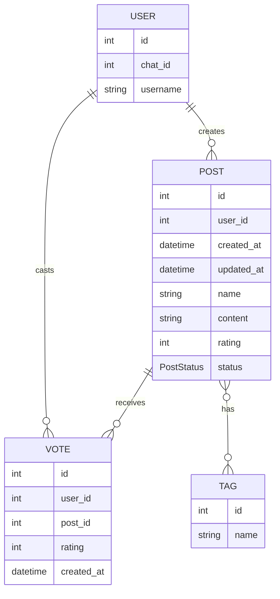

Краткий контрольный список для проверки:

## User: 
представляет пользователей системы. У него есть уникальный идентификатор, идентификатор чата и имя пользователя.

- Имеет отношение к `Post` (один-ко-многим) - Один пользователь может создать много постов.
- Имеет отношение к `Vote` (один-ко-многим) - Один пользователь может оставить много голосов

## Post:
представляет посты, созданные пользователями. Каждый пост связан с пользователем, который его создал, и имеет атрибуты, такие как название, описание, рейтинг и статус.

- Имеет отношение к `User` (многие-ко-одному)
- Имеет отношение к `Vote` (один-ко-многим) - Один пост может получать много голосов
- Имеет отношение к `Tag` (многие-ко-многим) - Один пост может иметь много тегов

## Tag:
представляет теги для категоризации постов. Каждый тег имеет уникальное название.

- Имеет отношение к Post (многие-ко-многим) - Один тег может быть присвоен многим постам
- Содержит уникальное название тега
- Используется для группировки и поиска постов по категориям

Связь многие-ко-многим реализована через промежуточную таблицу post_tags.

## Vote:
представляет голоса пользователей за посты. Каждый голос связан с пользователем и постом, а также содержит рейтинг и дату создания.

- Имеет отношение к `User` (многие-ко-одному)
- Имеет отношение к `Post` (многие-ко-одному)

Это создает полную систему круговых ссылок, где:

- У пользователей может быть много постов и голосов
- посты принадлежат одному пользователю и могут иметь много голосов
- Каждый голос связывает одного пользователя с одним постом

Импорт `TYPE_CHECKING` предотвращает проблемы с круговыми импортами, сохраняя при этом подсказки типов.

## Схема базы данных
