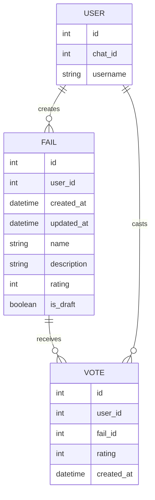

Краткий контрольный список для проверки:

## UserModel: 
представляет пользователей системы. У него есть уникальный идентификатор, идентификатор чата и имя пользователя.

- Имеет отношение к `FailModel` (один-ко-многим) - Один пользователь может создать много фейлов.
- Имеет отношение к `VoteModel` (один-ко-многим) - Один пользователь может оставить много голосов

## FailModel:
представляет фейлы, созданные пользователями. Каждый фейл связан с пользователем, который его создал, и имеет атрибуты, такие как название, описание и рейтинг.

- Имеет отношение к `UserModel` (многие-ко-одному)
- Имеет отношение к `VoteModel` (один-ко-многим) - Один фейл может получать много голосов

## VoteModel:
представляет голоса пользователей за фейлы. Каждый голос связан с пользователем и фейлом, а также содержит рейтинг и дату создания.

- Имеет отношение к `UserModel` (многие-ко-одному)
- Имеет отношение к `FailModel` (многие-ко-одному)

Это создает полную систему круговых ссылок, где:

- У пользователей может быть много фейлов и голосов
- Фейлы принадлежат одному пользователю и могут иметь много голосов
- Каждый голос связывает одного пользователя с одним фейлом

Импорт `TYPE_CHECKING` предотвращает проблемы с круговыми импортами, сохраняя при этом подсказки типов.

## Схема базы данных
